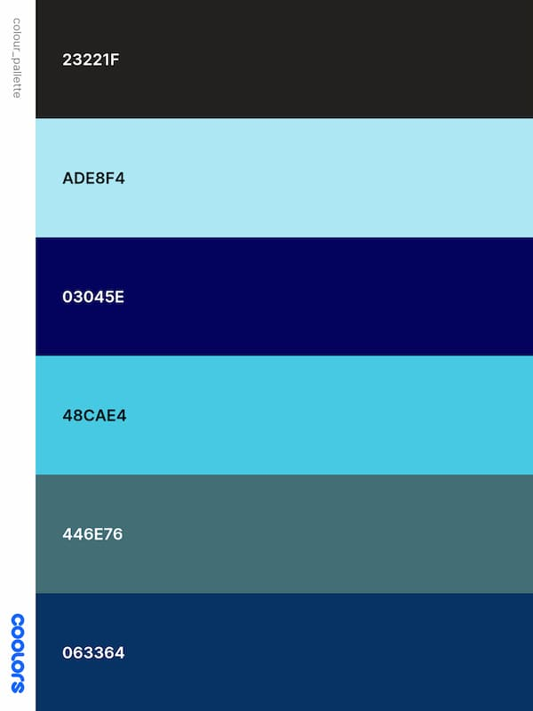

<h1 align="center">☀️ Weather Web App ❄️</h1>

☀️❄️☁️🌦️💧🌤️⚡

---

Welcome to the readme for the ‘Weather Web App', a collaborative project for the 1st Hackathon at the end of the JavaScript module for the Code Institutes Full Stack Software Developer Bootcamp.  
‘Our Awesome Weather App' is a responsive and accessible web application that provides users with real-time weather information. 

 

---

 
The live project can be found here: <a target="_blank" href="https://ekennard.github.io/Our-Awesome-Weather-App/"><em>Our Awesome Weather App<em></a>

 

---

## ☀️ Creators

**Abduaziz Ahmed**   
**Elizabeth Kennard**  
**Fatima Stacpoole**

---

## ☀️ Contents

[Introduction](#introduction) 
[Brief](#brief) 
[User Stories](#user-stories) 
[Project Planning](#project-planning) 
[Features](#features) 
[Navigation](#navigation) 
[Main content](#main-content) 
[AI Utilisation](#ai-utilisation) 
[Deployment](#deployment) 
[Technologies Used](#️technologies-used) 
[Testing and Debugging](#testing-and-debugging) 
[Validation](#validation) 
[Future Enhancements](#️future-enhancements) 
[Resources, Credits and Acknowledgements](#resources,-credits-and-acknowledgements) 

---

## ☀️ Introduction

‘Our Awesome Weather App' is a responsive and accessible web application that provides users with real-time weather information created for our first collaborative project for the end of the JavaScript module for the Code Institutes Full Stack Software Developer Bootcamp. The Aim of the project is to show what we have learnt on this module, and the preceeding HTML and CSS modules. 

---

## ☀️ Brief

The Code Institutes learning objectives for this project were as follows:

☁️ O1: Learners will be able to design and implement a one-page interactive Front-End web application using HTML, CSS, and JavaScript focusing on user experience design, accessibility, and responsive DOM manipulation. 
 
☁️ O2: Learners will be able to test and validate a one-page web application through development, implementation, and deployment stages. 
 
☁️ O3: Learners will be able to deploy a one-page web application to a Cloud platform ensuring functionality and security. 
 
☁️ O4: Learners will be able to maximize future maintainability through thorough documentation, clear code structure, and organization. 
 
☁️ O5: Learners will be able to implement and document front-end interactivity using core JavaScript, JavaScript libraries, or frameworks with a focus on DOM manipulation for a one-page web application. 
 
☁️ O6: Learners will be able to leverage AI tools to orchestrate the software development process.

---

## ☀️ User Stories

Several user stories were created at the start on the project and kept track of on Githubs project board. Certain user stories have different outcomes that what we initially want due to the constraints we encountered with APIs, but where possible we kept as true to these goals as possible (i.e we had to change the 7 day forcast for a 5 day).   
The user stories were as follows:

### ❄️ Must haves
☁️ As a user, I want to view the current weather for my location, so I can decide what to wear or whether to bring an umbrella. 
☁️ As a planner, I want to view a 7-day weather forecast, so I can view a 7-day weather forecast 
☁️ As a user, I want to search for weather in different cities, so I can check conditions for places I plan to travel. 
☁️ As a mobile user, I want the weather page to adjust neatly to my screen size, so I can easily use it on the go. 
☁️ As a visually impaired user, I want to navigate the site using screen readers and keyboard shortcuts, so the experience is inclusive. 

### ❄️ Should Haves
☁️ As a commuter, I want to see a live rain radar map, so I can plan my walk or drive accordingly. 
☁️ As a curious user, I want to toggle between Celsius and Fahrenheit, so I can view temperatures in my preferred format. 
☁️ As a weather enthusiast, I want to see animated transitions (like clouds or droplets) based on live conditions, so the site feels dynamic and engaging. 

### ❄️ Could Haves
☁️ As a user, I want to receive an alert when air quality reaches a poor level, so I can take precautions. 
☁️ As a health-conscious user, I want to see the local air quality index (AQI) with colour-coded warnings, so I can avoid going outside during unsafe conditions. 

---

## ☀️ Project Planning

### ❄️ API selction
The process of choosing which AP to use turned into a little bit of an arduous ordeal, and was not as straight forward as we would have hoped. Initially we had some solid ideas about how we wanted out site to look, and what data we wanted to present. However, we were 

### ❄️ Wireframes

Landing Page Wireframe

 

Main Page Wireframe

### ❄️ Colour Palette

### ❄️ Font Typography

Using these this colout pallette and fonts we created these root variables in the CSS to control all aspects of the site.

---

## ☀️ Features

The basic feature on the site were designed so that it wasnt cluttered, and that the user could easily and quickly look up the weather in an given city globaly.

These featurees include:
☁️ Current weather
☁️ 3 Hourly forcast
☁️ 5-day forecast; 
☁️ City search functionality; 
☁️ Mobile-first, fully responsive layout 
☁️ Accessible with keyboard and screen reader support 

---

## ☀️ Navigation

As we did not end up having more than one page on the site, navigation was unnessesary. 

---

## ☀️ Main content

The main aspect of the the page is taken up by the weather data. Two APis were used to generate the weather data. Initially we had wanted to have a current weather forcast, an hourly forcast and a 7 day forcast, however we quickly discovered the limitations with using certain APIs and opted for two which allowed us to access data for current daily weather conditions, a 3 hourly forcast, and a 5 day forcast.

The APIs are activated by an input box and a search button at the top of the page.

This initiates the function to create divs within the main area of the page, and to populate the page with the weather data for the city which was search for.

Once the weather information has been retrieved from the API the daily forcast in displayed within a `
` with the following information: 
☁️ The name of the city,  
☁️ An icon for the prominant weather type,  
☁️ The date for the city, 
☁️ The local time of the city, 
☁️ The actual temperature, 
☁️ The 'Feels Like' temperature, 
☁️ The weather type, 
☁️ Humidity percentage, 
☁️ And the wind speed. 

Below the daily forcast `
`, the 5 day forcast is displayed within a rolling carousel, shoing the following information: 
☁️ 5 Day Forcast title, 
☁️ the date, 
☁️ An icon for the prominant weather type, 
☁️ The temperature, 
☁️ The weather type. 

The background of the site is dynamic and switches between a night and day colour scheme, as well as displaying animations for rain and clouds depending, on which weather type is dominant at the search location. 

Day theme:

Day theme with clouds:

Night theme:

Night theme with rain:

----

## ☀️ AI Utilisation
During the planning stage, AI was utilised with setting out our user stories and aiding us with the general concept design. 
During the creation of the project Copilot was used for debugging and suggesting fixes for trickier issues.

---

## ☀️ Deployment
Our project was deployed straight away when the repo was created so that we could debug and test out code after each merge into the main branch.

---

## ☀️ Technologies Used
The site was created using HTML5, CSS, JavaScript, with Bootstrap elements, and two APIs from openweathermap.org. Our coding spaces were Visual Studio Code, and our version control and were don eusing Git & GitHub.

---

## ☀️ Testing and Debugging
Testing and debugging was a constant process throughout the project, and was made infinatly easier with the early deployment. Chrome developer tools were our first port of call for debugging and testing features, and for trickier bugs we utilised Copliot and the CI coding-coach chennel on Slack.

---

## ☀️ Validation

### ❄️ HTML

The code was validated using the W3 validator tools and in general was pretty clean. Our HTML file had a couple of issues but these were caused by an image source which was empty in the HTML as it was being populated using JavaScript based on the type of weather fo any given location. As such, it was decided that due to the time constraintes, we were not going to be able to fix this, as it would likely require rewriting some of the JS code. The same for the empty heading. 

### ❄️ CSS 

    

The CSS validation was very easy and returned no issues on the first pass.

### ❄️ Lighthouse

Lighthouse scores were also optimal on the first pass.

---

## ☀️ Future Enhancements

In the future, it would be nice to try and build in all the features from our user stories, for example:  
☁️ Hourly forcast 
☁️ 7 Day forcast 
☁️ Rain radar 

As well as implementing more features that would further enhance the user experience, for example: 
☁️ User preferences stored in local storage 
☁️ More dynamic animations for weather types (mist/fog, lightning, wind etc) 

---

## ☀️ Resources, Credits and Acknowledgements

Thanks to the API providers - openweathermap.org, our instructors, and the open-source community for tools and guidance!

---

https://getbootstrap.com/ 
https://fontawesome.com/ 
https://coolors.co/ 
https://www.w3.org/developers/tools/ 
https://www.markdownguide.org/basic-syntax/ 
https://www.w3schools.com/ 
https://developer.mozilla.org/ 
https://stackoverflow.com/ 
https://www.diffchecker.com/ 
https://www.unixtimestamp.com/ 
https://getemoji.com/ 
